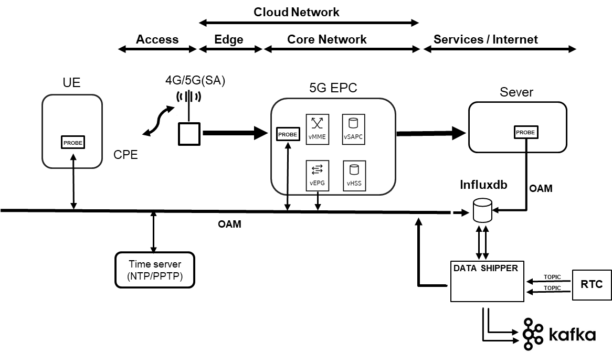

# 5Probe
## Introduction

*5Probe* is a software probe that extracts networking KPIs by analyzing the data plane traffic. 
The component is part of the [5G EVE](https://www.5g-eve.e) project, originally developed for the 
[5Tonic](https://www.5tonic.org/) laboratory.

## Network KPIs

The 5Probe extracts KPIs from end-users traffic by analyzing it with DPI techniques. It is able to produce the 
following KPIs for each end-user flow:
* Uplink Throughput (Bytes per second)
* Downlink Throughput (Bytes per second)
* Smooth Round-Trip Time (SRTT, in milliseconds)
* One Way Delay (OWD, in milliseconds)

For the next release we plan to include:
* Packet Loss (%)
* Availability (%)
* Reliability (%)

Some KPIs are protocol dependant, as we show in the following compatibility matrix:

|   | TCP | UDP | ICMP
| --- |--- | --- | ---
| **Throughput** | Yes | Yes | Yes |
| **SRTT** | Yes | No | Yes |
| **OWD** | Planned | Planned | Yes |
| **Packet Loss** | Planned | Planned | Planned |
| **Availability** | Planned | Planned | Planned |
| **Reliability** | Planned | Planned | Planned |

## Deployment architecture

The 5Tonic is a software component that can be deployed on top of any Linux machine, including Intel and ARM boxes. For 
an optimal deployment, we recommend deploying the probe in:
* The UE side, where it captures directly the UE incoming and outcoming traffic
* The Core side. The 5Probe is able to de-encapsulate GTP traffic for analyzing the Radio-Core traffic.
* The App side, where it captures the Service incoming and outcoming traffic.

The above figure shows how to integrate the 5Probe into a 4G or 5G network in the recommended capturing point.
The 5Probe stores the obtained KPIs into an [Influx DB](https://www.influxdata.com/) database and it requires
to have an OAM network that provides connectivity between the probes and the database. The figure also shows how the 
5Probes are integrated with the 5G EVE Data Collection module.

## Requirements

1. 5Probe runs on top of any Linux server. We provide binaries for x64 and ARM architectures.
2. OAM network for interconnecting the probes and the influx db server.
3. An instance of Influx DB.
4. For the OWD KPI the 5Probe requires a Time Source reference that synchronize each 5Probe server.

Optionally, it is useful to deploy a visualization tool like [Grafana](https://grafana.com/)
  
## APIs

By default, the 5Probe has an API that listens on port 5100. This API exposes the following endpoints: 

* Endpoints for configuring and managing the probe's sniffer:

| METHOD 	| URL 	| BODY 	| DESCRIPTION 	|  	|
|:------:	|:-------------:	|:------------------------:	|:-------------------------------------------------------------------------------------------------------------------------------------------------------------------------------------:	|---	|
| POST 	| /probe/start 	| {"filter":"tcp or icmp"} 	| The sniffer of the probe is started with the filter indicated in the body of the request (JSON). The filter has to comply with the BPF syntax. Examples: tcp port 80, tcp port 80 or icmp... 	|  	|
| GET 	| /probe/stop 	| - 	| It stops the sniffer if it is active. 	|  	|
| GET 	| /probe/status 	| - 	| Check the sniffer's status, if active, it will indicate the active filter. 	|  	|

* Endpoints for checking the information that the probe has:

| METHOD 	| URL 	| DESCRIPTION 	|
|:------:	|:----:	|:---------------------------------------------------------------------------------------------:	|
| GET 	| /kpi 	| The information of KPIs that are currently in the probe's internal storage will be displayed. 	|
| GET 	| /owd 	| The information of OWD that is currently in the probe's internal storage will be displayed. 	|

## Configuration and execution

To make configuration and execution simple, two scripts will be provided. The first one called setupProbe.sh which installs dependencies and gives the binary called probe the permissions it needs to capture traffic. The second one called launchProbe.sh will run the probe using the configuration file probe_config.yml and generate a file called output.txt in which the probe's log will be written.

### probe_config.yml
In this section you can see what the configuration file looks like and an example of it.

      probeID:  <Probe identifier>
      databaseIP: <InfluxDB IP address>
      dbUser: <Database user name>
      dbPassword: <Database user name password>
      dbWriteInterval: <Time in seconds indicating how often the metrics will be written from the probe to the database. By default, 10 seconds>
      interface: <Name of the interface where the probe are going to sniff>
      userPool: <List of subnets where users are>

An example of configuration is shown below  

      probeID: APP
      databaseIP: 10.3.3.30
      dbUser: admin
      dbPassword: admin
      dbWriteInterval: 10
      interface: enx0
      userPool:
         5G:
          - 10.3.7.0/24
          - 10.3.7.240/28
         4G:
          - 10.3.0.40/29
          - 10.3.0.32/29
          - 10.3.0.120/29

### Example of execution:
      
      $ ls
      launchProbe.sh  probe  probe_config.yaml  setupProbe.sh

      $ ./setupProbe.sh

      $ ./launchProbe.sh

When the launchProbe.sh script is executed the probe will be in background and listening on port 5100 where requests can be sent to configure the sniffer and view the data stored in the probe. 

   * Start sniffing:
      
      $ curl -X POST -d '{"filter": "tcp or icmp"}' IP:5100/probe/start

   * Stop sniffing:
      $ curl IP:5100/probe/stop
